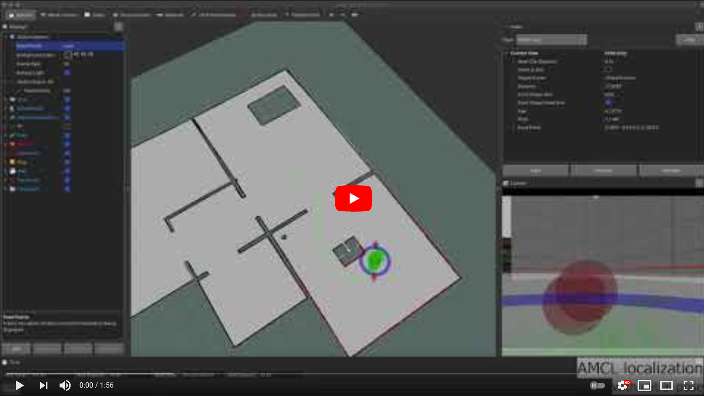

[//]: # (Image References)

[image1]: ./assets/gazebo_world.png "Gazebo"
[image2]: ./assets/gazebo_corridor_empty.png "Gazebo"
[image3]: ./assets/gazebo_corridor_features.png "Gazebo"
[image4]: ./assets/gazebo_corridor_robot_1.png "Gazebo"
[image5]: ./assets/gazebo_corridor_robot_2.png "Gazebo"
[image6]: ./assets/tf_tree.png "TF"
[image7]: ./assets/graph_1.png "Graph"
[image8]: ./assets/roswtf.png "roswtf"
[image9]: ./assets/map_1.png "map"
[image10]: ./assets/map_2.png "map"
[image11]: ./assets/graph_2.png "Graph"
[image12]: ./assets/graph_3.png "Graph"
[image13]: ./assets/graph_4.png "Graph"
[image14]: ./assets/hector_slam_1.png "Hector SLAM"
[image15]: ./assets/hector_slam_2.png "Hector SLAM"
[image16]: ./assets/hector_corridor_empty_1.png "Hector SLAM"
[image17]: ./assets/hector_corridor_empty_2.png "Hector SLAM"
[image18]: ./assets/hector_corridor_empty_3.png "Hector SLAM"
[image19]: ./assets/hector_corridor_features_1.png "Hector SLAM"
[image20]: ./assets/gmapping_room_1.png "Gmapping"
[image21]: ./assets/gmapping_room_2.png "Gmapping"
[image22]: ./assets/gmapping_corridor_empty_1.png "Gmapping"
[image23]: ./assets/gmapping_corridor_empty_2.png "Gmapping"
[image24]: ./assets/gmapping_corridor_features_1.png "Gmapping"
[image25]: ./assets/amcl_frames.png "AMCL"
[image26]: ./assets/amcl_1.png "AMCL"
[image27]: ./assets/amcl_2.png "AMCL"
[image28]: ./assets/amcl_3.png "AMCL"
[image29]: ./assets/amcl_corridor_1.png "AMCL"
[image30]: ./assets/amcl_corridor_2.png "AMCL"
[image31]: ./assets/amcl_corridor_3.png "AMCL"
[image32]: ./assets/amcl_corridor_4.png "AMCL"
[image33]: ./assets/amcl_corridor_5.png "AMCL"
[image34]: ./assets/interactive_marker.png "Interactive marker"
[image35]: ./assets/overview_tf.png "move_base"
[image36]: ./assets/amcl_init_1.png "AMCL"
[image37]: ./assets/amcl_init_2.png "AMCL"
[image38]: ./assets/navigation_1.png "navigation"
[image39]: ./assets/navigation_2.png "navigation"
[image40]: ./assets/navigation_3.png "navigation"
[image41]: ./assets/navigation_4.png "navigation"
[image42]: ./assets/navigation_5.png "navigation"
[image43]: ./assets/navigation_6.png "navigation"
[image44]: ./assets/navigation_7.png "navigation"
[image45]: ./assets/navigation_corridor_1.png "navigation"
[image46]: ./assets/navigation_corridor_2.png "navigation"
[image47]: ./assets/navigation_corridor_3.png "navigation"
[image48]: ./assets/navigation_corridor_4.png "navigation"
[image49]: ./assets/waypoint_1.png "waypoint"
[image50]: ./assets/waypoint_2.png "waypoint"
[image51]: ./assets/waypoint_3.png "waypoint"
[image52]: ./assets/waypoint_4.png "waypoint"
[image53]: ./assets/waypoint_5.png "waypoint"
[image54]: ./assets/waypoint_6.png "waypoint"

# Micrimouse ROS

# Videó az eredmények bemutatásáról

<a href="https://youtu.be/XveJMrCh9vw"></a>  
<a href="https://youtu.be/6M7XvkN7sc0"></a>  
<a href="https://youtu.be/hxvz2DUILys"></a>

# Tartalomjegyzék
1. [Kezdőcsomag](#Kezdőcsomag)  
2. [Gazebo világok](#Gazebo-világok)  
3. [Ground truth térkép készítése](#Ground-truth-térkép-készítése)
4. [IMU és odometria szenzorfúzió](#IMU-és-odometria-szenzorfúzió)  
5. [Mapping](#Mapping)  
5.1. [Hector SLAM](#Hector-SLAM)  
5.2. [GMapping](#GMapping)  
5.3. [Map saver](#Map-saver)
6. [Lokalizáció](#Lokalizáció)  
6.1. [AMCL](#AMCL)
7. [Navigáció](#Navigáció)  
7.1. [Recovery akciók](#Recovery-akciók)
8. [Waypoint navigáció](#Waypoint-navigáció)  
8.1. [Grafikusan a follow_waypoints csomaggal](#Grafikusan-a-follow_waypoints-csomaggal)  
8.2. [Waypoint navigáció C++ ROS node-ból](#Waypoint-navigáció-C++-ROS-node-ból)

# Kezdőcsomag
A lecke kezdőcsomagja épít az előző fejezetekre, de egy külön GIT repositoryból dolgozunk, így nem feltétele az előző csomagok megléte.

A kiindulási projekt tartalmazza a Gazebo világ szimulációját, az alap differenciálhajtású MOGI robotunk modelljét és szimulációját, a kamera, IMU és Lidar szimulációját, valamint az alap launchfájlokat és RViz fájlokat.

A kezdőprojekt letöltése:
```console
git clone -b starter-branch https://github.com/MOGI-ROS/Week-7-8-Navigation.git
```

A kezdőprojekt tartalma a következő:
```console
david@DavidsLenovoX1:~/bme_catkin_ws/src/Week-7-8-Navigation/bme_ros_navigation$ tree
.
├── CMakeLists.txt
├── config
│   ├── costmap_common_params.yaml
│   ├── dwa_local_planner_params.yaml
│   ├── global_costmap_params.yaml
│   ├── global_planner_params.yaml
│   ├── local_costmap_params.yaml
│   └── move_base_params.yaml
├── launch
│   ├── check_urdf.launch
│   ├── spawn_robot.launch
│   ├── teleop.launch
│   └── world.launch
├── maps
│   ├── corridor_hector.yaml
│   ├── corridor.pgm
│   ├── corridor.yaml
│   ├── map_hector.yaml
│   ├── map.pgm
│   ├── map.yaml
│   └── saved_maps
│       ├── corridor.pgm
│       ├── corridor.yaml
│       ├── map.pgm
│       └── map.yaml
├── meshes
│   ├── lidar.dae
│   ├── mogi_bot.dae
│   └── wheel.dae
├── package.xml
├── rviz
│   ├── check_urdf.rviz
│   └── mogi_world.rviz
├── urdf
│   ├── materials.xacro
│   ├── mogi_bot.gazebo
│   └── mogi_bot.xacro
└── worlds
    ├── 20m_corridor
    │   ├── model.config
    │   └── model.sdf
    ├── 20m_corridor_empty.world
    ├── 20m_corridor_features.world
    ├── map_creation
    │   ├── 20m_corridor_map_creation.world
    │   └── world_map_creation.world
    └── world_modified.world
```

# Gazebo világok

A fejezet során a már jól megismert `world_modified.world` Gazebo világot fogjuk használni, amit a következő paranccsal bármikor ki tudunk próbálni:
```console
roslaunch bme_ros_navigation world.launch
```
![alt text][image1]

Emellett azonban szükségünk lesz egy másik világra is, ami egy 20m hosszú folyosóból áll, ezen fogjuk tesztelni a térképezési algoritmusokat. Ennek két verzióját hoztam létre előre, egy ürest és egy olyat, ahol vannak objektumok a folyosón. Ezeket is ki tudjuk próbálni:
```console
roslaunch bme_ros_navigation world.launch world_file:='$(find bme_ros_navigation)/worlds/20m_corridor_empty.world'
```
![alt text][image2]
```console
roslaunch bme_ros_navigation world.launch world_file:='$(find bme_ros_navigation)/worlds/20m_corridor_features.world'
```
![alt text][image3]

A robotunkat is betölthetjük a világba, a korábbiakhoz hasonlóan a `spawn_robot.launch` segítségével. Robot betöltése az alap világba:
```console
roslaunch bme_ros_navigation spawn_robot.launch
```
És a világ megadásával betölthetjük a folyosóra is:
```console
roslaunch bme_ros_navigation spawn_robot.launch world:='$(find bme_ros_navigation)/worlds/20m_corridor_empty.world' x:=-7 y:=2
```
![alt text][image4]
Vegyük észre, hogy felülbíráljuk a robot kezdeti pozícióját is ezzel a paranccsal, nézzük meg mi történik nélküle.
![alt text][image5]

A robot ilyekor sem a (0,0) pozícióban indul, mert a `spawn_robot.launch` fájlban ezek az alapértelmezett értékek:
```xml
...
  <arg name="x" default="2.5"/>
  <arg name="y" default="1.5"/>
  <arg name="z" default="0"/>
  <arg name="roll" default="0"/>
  <arg name="pitch" default="0"/>
  <arg name="yaw" default="0"/>
...
```

Ennek megfelelően a másik folyosómodellre is elhelyezhető a robot:
```console
roslaunch bme_ros_navigation spawn_robot.launch world:='$(find bme_ros_navigation)/worlds/20m_corridor_features.world' x:=-7 y:=2
```

Próbáljuk ki a távirányítót is, mert kiegészítjük egy új hasznos funkcióval ebben a fejezetben, és ez az `Interactive marker twist server` csomag használata, amit így tudtok telepíteni:
```console
sudo apt install ros-$(rosversion -d)-interactive-marker-twist-server
```
![alt text][image34]

# Ground truth térkép készítése

Lehetőségünk van a Gezbo világunkból egy úgy nevezett ground truth térképet készíteni. Ehhez a `pgm_map_creator` csomagot használhatjuk.
Ez nem egy hivatalos ROS csomag, így letölthető a tárgy GitHub oldaláról a catkin workspace-etekbe:
```console
git clone https://github.com/MOGI-ROS/pgm_map_creator
```
A csomag használatához be kell tennünk egy plugint a Gazebo világunkba, ezért csináljunk róla egy másolatot `world_map_creation.world` néven a `worlds/map_creation` mappába.

Tegyük be a plugint a fájl végére a `</world>` tag elé:

```xml
...
    <plugin filename="libcollision_map_creator.so" name="collision_map_creator"/>
  </world>
</sdf>
```

A plugin használatához indítsuk el a világunk szimulációját, ehhez nincs szükség a grafikus frontendre, így elég a gzserver-t használnunk.

```console
gzserver src/Week-7-8-Navigation/bme_ros_navigation/worlds/world_map_creation.world
```

És egy másik terminálból indítsuk el a map creator-t:
```console
roslaunch pgm_map_creator request_publisher.launch
```

A `request_publisher` launch fájlban tudjuk megadni a térképünk méretét és felbontását.
```xml
<?xml version="1.0" ?>
<launch>
  <arg name="map_name" default="map" />
  <arg name="save_folder" default="$(find pgm_map_creator)/maps" />
  <arg name="xmin" default="-15" />
  <arg name="xmax" default="15" />
  <arg name="ymin" default="-15" />
  <arg name="ymax" default="15" />
  <arg name="scan_height" default="5" />
  <arg name="resolution" default="0.05" />

  <node pkg="pgm_map_creator" type="request_publisher" name="request_publisher" output="screen" args="'($(arg xmin),$(arg ymax))($(arg xmax),$(arg ymax))($(arg xmax),$(arg ymin))($(arg xmin),$(arg ymin))' $(arg scan_height) $(arg resolution) $(arg save_folder)/$(arg map_name)">
  </node>
</launch>
```

Előre elkészítettem a grund truth térképet a `world_modified.world` és a `20m_corridor_empty.world` alapján, így ezeket használhatjuk a kezdőcsomagból.  
![alt text][image9]
![alt text][image10]

A `pgm_map_creator` alapértelmezetten a saját csomagjának a maps mappájába menti a térkép fájlokat. A `.pgm` fájlok egyszerű bitmap-ek, többek között megnyithatók a GIMP vagy Inkscape szoftverekkel.

# IMU és odometria szenzorfúzió
Vessünk még egy pillantást a `spawn_robot.launch` fájlra! Ebben ugyanis van pár változás a korábbiakhoz képest. Bekerült egy új node:
```xml
  <!-- Robot pose EKF for sensor fusion -->
  <node pkg="robot_pose_ekf" type="robot_pose_ekf" name="robot_pose_ekf">
    <remap from="imu_data" to="/imu/data"/>
    <param name="output_frame" value="odom"/>
    <param name="base_footprint_frame" value="base_footprint"/>
    <param name="freq" value="30.0"/>
    <param name="sensor_timeout" value="1.0"/>
    <param name="odom_used" value="true"/>
    <param name="imu_used" value="true"/>
    <param name="vo_used" value="false"/>
    <param name="gps_used" value="false"/>
    <param name="debug" value="false"/>
    <param name="self_diagnose" value="false"/>
  </node>
```
És ezzel együtt változott egy picit a `mogi_bot.gazebo` fájl is:
```xml
<publishOdomTF>false</publishOdomTF>
```

Mostantól nem a Gazebo plugin csinálja a transzformációt az odom fix frame és a robot alváza között, hanem az EKF szenzorfúzió. Ez a felállás sokkal jobban hasonlít egy valódi robotra, ahol a szenzor adatok (IMU és Odoemtria) megadott topicokba kerülnek, majd ezek alapján a szenzorfúzió hozza létre a transzformációt.
Nézzük is meg a TF tree-t, ami a `rosrun rqt_tf_tree rqt_tf_tree` paranccsal tudok elindítani.
![alt text][image6]

Valamint a node-jaink összekötését is vizsgáljuk meg az `rqt_graph` paranccsal:
![alt text][image7]

## Hibakeresés
Hibakeresés miatt, kapcsoljuk most vissza a `publishOdomTF`-et a Gazebo pluginban, és nézzük meg mi történik!

A robotunk furcsán ugrál az RVizben megjelenítve, de szerencsére ennél nagyobb baj nem történt:
![alt text][image8]

Azokban az esetekben, amikor sejtjük, hogy valami nincs rendben a TF-fel, sokat segít a `roswtf` parancssoros tool, ami ebben az esetben is azonnal észrevette a hibát:
```console
...
Found 1 error(s).

ERROR TF multiple authority contention:
 * node [/robot_pose_ekf] publishing transform [base_footprint] with parent [odom] already published by node [/gazebo]
 * node [/gazebo] publishing transform [base_footprint] with parent [odom] already published by node [/robot_pose_ekf]
```

A végén ne felejtsük el visszaállítani a Gazebo plugint!

# Mapping

Térképezésre általában SLAM (simultaneous localization and mapping) algoritmusokat használunk, amik képesek egyszerre létrehozni a környezet térképét és meghatározni a robot pozícióját és orientációját a térképen (lokalizáció).
Az elmúlt években egyre inkább terjednek a mono, stereo vagy RGBD kamerát használó SLAM algoritmusok, de mi most két Lidart használó algoritmust próbálunk ki.

## Hector SLAM

A [Hector SLAM](http://wiki.ros.org/hector_mapping) a Darmstadt-i egyetem fejlesztése, nagyon egyszerű használni, akár szabd kézben tartott Lidarral is, ugyanis pusztán csak a Lidar méréseit használja a SLAM probléma megoldása során.
Ez az előnye egyben a hátránya is, mivel nem használja a robot odometriáját, így speciális körülmények között nem használható, látunk is erre példát az üres folyosó esetén.

Előtte azonban próbáljuk ki a Hector SLAM-et a már megszokott Gazebo világunkon.

Természetesen a Hector SLAM nem része az alap ROS telepítésnek, így ezt fel kell tennünk a Linuxunk csomagkezelőjével:
```console
sudo apt install ros-$(rosversion -d)-hector-slam 
```

Hozzuk létre a `hector_slam.launch` fájlt:
```xml
<?xml version="1.0"?>
<launch>

  <!-- Ground truth map file -->
  <arg name="map_file" default="$(find bme_ros_navigation)/maps/map_hector.yaml"/>

  <node pkg="hector_mapping" type="hector_mapping" name="hector_mapping" output="screen">
    <param name="base_frame" value="base_link" />
    <param name="odom_frame" value="odom"/>
    <param name="output_timing" value="false"/>
    <param name="use_tf_scan_transformation" value="true"/>
    <param name="use_tf_pose_start_estimate" value="false"/>
    <param name="scan_topic" value="scan"/>
    <!-- Map size / start point -->
    <param name="map_resolution" value="0.025"/>
    <param name="map_size" value="2048"/>
    <param name="map_start_x" value="0.5"/>
    <param name="map_start_y" value="0.5" />
    <!--param name="laser_z_min_value" value="-2.5" /-->
    <!--param name="laser_z_max_value" value="3.5" /-->
    <!-- Map update parameters -->
    <param name="update_factor_free" value="0.4"/>
    <param name="update_factor_occupied" value="0.7" />    
    <param name="map_update_distance_thresh" value="0.6"/>
    <param name="map_update_angle_thresh" value="0.9" />
    <param name="pub_map_odom_transform" value="true"/>
    <param name="pub_drawings" value="true"/>
    <param name="pub_debug_output" value="true"/>
  </node>

  <!-- Ground truth map Server -->
  <node name="map_server" pkg="map_server" type="map_server" args="$(arg map_file)">
    <remap from="map" to="map_groundtruth"/>
  </node>

</launch>
```

>A ground truth térképünket a `map_server` node fogja adni, ezt szintén fel kell telepítsük a használatához:
>```console
>sudo apt install ros-$(rosversion -d)-map-server 
>```

Majd indítsuk el a világ és a robot szimulációját:

```console
roslaunch bme_ros_navigation spawn_robot.launch
```

A Hector SLAM algoritmust:
```console
roslaunch bme_ros_navigation hector_slam.launch
```

Valamint a távirányítót:
```console
roslaunch bme_ros_navigation teleop.launch
```

Az RViz konfigurációt úgy állítottam be, hogy a ground truth térképet lila színnel vetítse a háttérbe.
![alt text][image14]

Vezessük körbe a robotunkat:
![alt text][image15]

Vessünk egy pillantást az rqt_graph-ra:

![alt text][image12]

### Üres folyosó

Próbáljuk ki a Hector SLAM-et az üres folyosón, indítsuk el a szimulációt a folyosóval:
```console
roslaunch bme_ros_navigation spawn_robot.launch world:='$(find bme_ros_navigation)/worlds/20m_corridor_empty.world' x:=-7 y:=2 
```

Indítsuk el a Hector SLAM-et a megfelelő ground truth térképpel:
```console
roslaunch bme_ros_navigation hector_slam.launch map_file:='$(find bme_ros_navigation)/maps/corridor_hector.yaml'
```

És természetesen indítsunk egy távirányítót is:
```console
roslaunch bme_ros_navigation teleop.launch
```
![alt text][image18]

Vezessük végig a robotot a folyosón:

![alt text][image17]

És nézzük meg a térképet:

![alt text][image16]

Láthatjuk, hogy a pusztán a lidar jeleire támaszkodó algoritmus jelentős hibát (kb 10m) szedett össze, a folyosón az 5m érzékelési távolsággal rendelkező lidar használata során. Mekkora lenne a hiba egy 30m hosszú folyosón?

### Folyosó tárgyakkal

Nézzük meg, hogy segít-e a Hector SLAM-nek ha vannak tárgyak a folyosón!

Indítsuk el a szimulációt és a többi node-ot, ahogy az előbb:
```console
roslaunch bme_ros_navigation spawn_robot.launch world:='$(find bme_ros_navigation)/worlds/20m_corridor_features.world' x:=-7 y:=2
```

```console
roslaunch bme_ros_navigation hector_slam.launch map_file:='$(find bme_ros_navigation)/maps/corridor_hector.yaml'
```

```console
roslaunch bme_ros_navigation teleop.launch
```

![alt text][image19]

A folyosón jól vizsgázott a Hector SLAM abban az esetben, ha voltak azonosítható jellegzeteségek a térképezés során.

## GMapping

A másik SLAM algoritmus, amit kipróbálunk a [GMapping](http://wiki.ros.org/gmapping). A GMapping nem csak a Lidar jeleit használja, hanem a robot odometriáját is, és nagyon sok paraméterrel rendelkezik.

Ez sem része az alap ROS csomagnak, telepítenünk kell:
```console
sudo apt install ros-$(rosversion -d)-gmapping 
```

Hozzuk létre a `gmapping.launch` fájlt:
```xml
<?xml version="1.0"?>
<launch>

  <!-- Ground truth map file -->
  <arg name="map_file" default="$(find bme_ros_navigation)/maps/map.yaml"/>

  <node pkg="gmapping" type="slam_gmapping" name="gmapping" output="screen" >
    <param name="odom_frame" value="odom" />
    <param name="base_frame" value="base_link" />
    <!-- Process 1 out of every this many scans (set it to a higher number to skip more scans)  -->
    <param name="throttle_scans" value="1"/>
    <param name="map_update_interval" value="3.0"/> <!-- default: 5.0 -->

    <!-- The maximum usable range of the laser. A beam is cropped to this value.  -->
    <param name="maxUrange" value="5.0"/>
    <!-- The maximum range of the sensor. If regions with no obstacles within the range of the sensor should appear as free space in the map, set maxUrange < maximum range of the real sensor <= maxRange -->
    <param name="maxRange" value="5.0"/>

    <param name="sigma" value="0.05"/>
    <param name="kernelSize" value="1"/>
    <param name="lstep" value="0.05"/>
    <param name="astep" value="0.05"/>
    <param name="iterations" value="5"/>
    <param name="lsigma" value="0.075"/>
    <param name="ogain" value="3.0"/>
    <param name="minimumScore" value="30.0"/>
    <!-- Number of beams to skip in each scan. -->
    <param name="lskip" value="0"/>
    <param name="srr" value="0.01"/>
    <param name="srt" value="0.02"/>
    <param name="str" value="0.01"/>
    <param name="stt" value="0.02"/>

    <!-- Process a scan each time the robot translates this far  -->
    <param name="linearUpdate" value="0.1"/>

    <!-- Process a scan each time the robot rotates this far  -->
    <param name="angularUpdate" value="0.1"/>
    <param name="temporalUpdate" value="1.0"/>
    <param name="resampleThreshold" value="0.5"/>

    <!-- Number of particles in the filter. default 30        -->
    <param name="particles" value="30"/>

    <!-- Initial map size  -->
    <param name="xmin" value="-10.0"/>
    <param name="ymin" value="-10.0"/>
    <param name="xmax" value="10.0"/>
    <param name="ymax" value="10.0"/>

    <!-- Processing parameters (resolution of the map)  -->
    <param name="delta" value="0.025"/>
    <param name="llsamplerange" value="0.01"/>
    <param name="llsamplestep" value="0.01"/>
    <param name="lasamplerange" value="0.005"/>
    <param name="lasamplestep" value="0.005"/>
  </node> 

  <!-- Ground truth map Server -->
  <node name="map_server" pkg="map_server" type="map_server" args="$(arg map_file)">
    <remap from="map" to="map_groundtruth"/>
  </node>

</launch>
```

Majd indítsuk el a szimulációt az alap világon.
```console
roslaunch bme_ros_navigation spawn_robot.launch
```

Indítsuk el a gmapping-et, és a távirányítót is:
```console
roslaunch bme_ros_navigation gmapping.launch
```

```console
roslaunch bme_ros_navigation teleop.launch
```

És nézzük meg az `rqt_graph`-ot:
![alt text][image11]

![alt text][image21]

Az előbbihez hasonlóan vezessük végig a robotunkat a szobán:
![alt text][image20]

### Üres folyosó

Próbáljuk ki a GMappinget az üres folyosón:
```console
roslaunch bme_ros_navigation spawn_robot.launch world:='$(find bme_ros_navigation)/worlds/20m_corridor_empty.world' x:=-7 y:=2
```

```console
roslaunch bme_ros_navigation gmapping.launch map_file:='$(find bme_ros_navigation)/maps/corridor.yaml'
```

```console
roslaunch bme_ros_navigation teleop.launch
```

![alt text][image22]

A GMapping az odometria használata miatt egész kis hibát szedett össze az üres folyosón, de ez sem volt képes teljesen pontosan felmérni a folyosó hosszát.
![alt text][image23]

### Folyosó tárgyakkal
Nézzük meg a GMappinget is tárgyakkal:
```console
roslaunch bme_ros_navigation spawn_robot.launch world:='$(find bme_ros_navigation)/worlds/20m_corridor_features.world' x:=-7 y:=2
```

```console
roslaunch bme_ros_navigation gmapping.launch map_file:='$(find bme_ros_navigation)/maps/corridor.yaml'
```

```console
roslaunch bme_ros_navigation teleop.launch
```
![alt text][image24]


## Map saver

Ha szeretnénk elmenteni a SLAM algoritmus által létrehozott térképet, akkor a `map_server` csomag `map_saver` node-ját tudjuk erre a célra használni. A `map_server`-rel találkoztunk már korábban is, ez adta a ground truth térképünket.

A `map_saver` abba a mappába menti a térképet, ahonnan indítjuk!
Használjuk most erre a `saved_maps` mappát a maps-en belül, de a kezdőcsomag már alapból tartalmazza ezeket a térképeket!

```console
rosrun map_server map_saver -f map
```

Példa:

```console
david@DavidsLenovoX1:~/bme_catkin_ws/src/Week-7-8-Navigation/bme_ros_navigation/maps/saved_maps$ rosrun map_server map_saver -f map
[ INFO] [1614518022.653341900]: Waiting for the map
[ INFO] [1614518022.875830700, 563.990000000]: Received a 800 X 800 map @ 0.025 m/pix
[ INFO] [1614518022.875936200, 563.990000000]: Writing map occupancy data to map.pgm
[ INFO] [1614518022.933453800, 564.011000000]: Writing map occupancy data to map.yaml
[ INFO] [1614518022.933801100, 564.011000000]: Done

david@DavidsLenovoX1:~/bme_catkin_ws/src/Week-7-8-Navigation/bme_ros_navigation/maps/saved_maps$ ls
map.pgm  map.yaml
```

# Lokalizáció

Lokalizáció esetén a robotunk pontos pozícióját és orientációját határoztuk meg egy ismert térképen. Ehhez a ROS [AMCL (Advanced Monte Carlo Localization) csomagját](http://wiki.ros.org/amcl) fogjuk használni. Ez a lokalizációs módszer egy úgynevezett particle filter algoritmus, ami induláskor véletlenszerűen "szór szét" particle-öket a téképen, és a lidar szenzoradataiból próbálja kiszűrni azokat a lehetséges particle-öket, amikkel konzisztensek a szenzoradataink. Ahogy mozgunk a robottal a lehetséges particle-ök a robot valós helyéhez konvergálnak.

## AMCL

Az AMCL sem része az alap ROS telepítésnek, így tegyük fel ezt a csomagot:
```console
sudo apt install ros-$(rosversion -d)-amcl
```

Majd hozzuk létre az `amcl.launch` fájlt. Ebben az esetben nem lesz szükségünk a ground truth térképre, és vegyük észre, hogy alapértelmezetten a korábbi térképezés által rögzített térképet töltjük be a `map_server`-nek.

```xml
<?xml version="1.0"?>
<launch>

  <!-- Map file for localization -->
  <arg name="map_file" default="$(find bme_ros_navigation)/maps/saved_maps/map.yaml"/>
  <!-- It can be an environmental variable, too -->
  <!--arg name="map_file" default="$(env AMCL_MAP_FILE)"/-->

  <!-- Map Server -->
  <node name="map_server" pkg="map_server" type="map_server" args="$(arg map_file)">
  </node>

  <!-- AMCL Node -->
  <arg name="initial_pose_x"  default="0.0"/>
  <arg name="initial_pose_y"  default="0.0"/>
  <arg name="initial_pose_a"  default="1.57"/>
  <node name="amcl" pkg="amcl" type="amcl" output="screen">
    <param name="odom_frame_id" value="odom"/>
    <param name="odom_model_type" value="diff-corrected"/>
    <param name="base_frame_id" value="base_link"/>
    <param name="global_frame_id" value="map"/>
    <param name="scan_topic" value="scan"/>
    <!-- If you choose to define initial pose here -->
    <param name="initial_pose_x" value="$(arg initial_pose_x)"/>
    <param name="initial_pose_y" value="$(arg initial_pose_y)"/>
    <param name="initial_pose_a" value="$(arg initial_pose_a)"/>
    <!-- Parameters for inital particle distribution -->
    <param name="initial_cov_xx" value="9.0"/>
    <param name="initial_cov_yy" value="9.0"/>
    <param name="initial_cov_aa" value="9.8"/>
    <!-- Dynamically adjusts particles for every iteration -->
    <param name="min_particles" value="500"/>
    <param name="max_particles" value="2000"/>
    <!-- Perform update parameters -->
    <param name="update_min_d" value="0.1"/>
    <param name="update_min_a" value="0.1"/>
    <param name="laser_model_type" value="likelihood_field"/>
    <param name="laser_max_range" value="-1.0"/>
    <param name="odom_alpha1" value="0.1"/>
    <param name="odom_alpha2" value="0.1"/>
    <param name="odom_alpha3" value="0.3"/>
    <param name="odom_alpha4" value="0.1"/>
    <param name="odom_alpha5" value="0.1"/>
    <!-- Transform tolerance needed on slower machines -->
    <param name="transform_tolerance" value="1.0"/>
  </node>

</launch>
```

Indítsuk el a szimulációt:

```console
roslaunch bme_ros_navigation spawn_robot.launch
```

Indítsuk el az AMCL-t is, azonban ne az alapértelmezett mentett térképpel, hanem először a ground truth térképpel:
```console
roslaunch bme_ros_navigation amcl.launch map_file:='$(find bme_ros_navigation)/maps/map.yaml'
```

Indítsunk egy távirányítót is, viszont mielőtt nekiállnánk vezetni, nézzünk rá az rqt_graph-ra és a TF tree-re!

```console
roslaunch bme_ros_navigation teleop.launch
```

![alt text][image13]
![alt text][image25]

Próbáljuk ki a lokalizációt, mozogjunk a robotunkkal:

Azt tapasztaljuk, hogy az ennyire tökéletes térkép nehézséget okoz az AMCL-nek, érdemes olyan térképpel használnunk a lokalizációt, ami azzal a szenzorral készült, amit a lokalizációs is használ!

Most indítsuk e a mentett térképpel, és nézzük meg mi történik:
```console
roslaunch bme_ros_navigation amcl.launch
```

![alt text][image26]
![alt text][image27]
![alt text][image28]

Próbáljuk ki a lokalizációt a folyosón is:
```console
roslaunch bme_ros_navigation spawn_robot.launch world:='$(find bme_ros_navigation)/worlds/20m_corridor_features.world' x:=-7 y:=2
```

```console
roslaunch bme_ros_navigation amcl.launch map_file:='$(find bme_ros_navigation)/maps/saved_maps/corridor.yaml'
```
Induláskor az AMCL-nek fogalma sincs, hogy hol a robot, ahogy ezt korábban is láttuk:
![alt text][image29]

Mivel ezen a térképen nagyon kevés jól felismerhető feature van, elképzelhető, hogy az AMCL tévesen lokalizálja a robotot:
![alt text][image30]

Ha vezetjük tovább a robotot, a particle-ök elkezdenek divergálni a robot pozíciójától:
![alt text][image31]

Ez addig fokozódik, amíg új particle-ök jelennek meg:
![alt text][image32]

És egy idő után képes sikeresen lokalizálni a robotunkat:
![alt text][image33]

Téves konvergálást úgy tudunk a legjobban elkerülni, ha van valamennyi elképzelésünk a robotunk kezdeti pozíciójáról és orientációjáról. Ezeket a launch fájlban megadhatjuk, és csökkenthetjük a kezdeti részecskék eloszlását, erről [bővebben az AMCL wiki oldalán olvashattok](http://wiki.ros.org/amcl#Parameters):

```xml
    <!-- If you choose to define initial pose here -->
    <param name="initial_pose_x" value="$(arg initial_pose_x)"/>
    <param name="initial_pose_y" value="$(arg initial_pose_y)"/>
    <param name="initial_pose_a" value="$(arg initial_pose_a)"/>
    <!-- Parameters for inital particle distribution -->
    <param name="initial_cov_xx" value="9.0"/>
    <param name="initial_cov_yy" value="9.0"/>
    <param name="initial_cov_aa" value="9.8"/>
```

Az AMCL-nek adhatunk egy kezdeti pozíciót is az RViz segítségével:
![alt text][image36]
Fontos megjegyezni, hogy ezt csak a `map` frame-ben tehetjük meg, az `odom`-ban nem!
![alt text][image37]
# Navigáció

A [ROS nyílt forrású navigációs stackje](http://wiki.ros.org/navigation) hatalmas, úgyhogy az implementációjának részleteibe nem megyünk bele, a legfontosabb tulajdonságait nézzük meg.

A navigációs stack működik tetszőleges SLAM vagy lokalizációs csomaggal, ebben az esetben mi egy előre rögzített térképen az AMCL-t használjuk majd lokalizációra.

A navigációs stacket úgy tervezték, hogy könnyen használható legyen különböző lokális és globális útvonaltervezővel. A globális tervezéshez a [NavfnROS](http://wiki.ros.org/navfn) csomagot, a lokális tervezéshez pedig a [DWAPlannerROS](http://wiki.ros.org/dwa_local_planner) csomagot fogjuk használni.

A ROS navigációs stackjének működése kapcsán érdemes végig nézni a [hivatalos tutorialok](http://wiki.ros.org/navigation/Tutorials)at, valamint a [ROS Navigation Tuning Guide](http://kaiyuzheng.me/documents/navguide.pdf)-ot Kaiyu Zheng-től.

A navigációs stack-et a [`move_base`](http://wiki.ros.org/move_base) node indítja el, és ez a belső felépítése:
![alt text][image35]

A fő részei tehát:
1) Globális costmap, gyakorlatilag ez a térkép, a robot környezetében lévő statikus akadályok szerepelnek rajta, amiket megnövelünk, hogy elkerüljük a potenciális ütközést velük. A robot a navigáció során nem használja közvetlenül a robot szenzorjait ennek a frissítéséhez.
2) A globális útvonaltervező az előbbi global costmap-et használja fel a tervezéshez, odafigyelve arra, hogy a robot fizikai méretének megfelelően tervezze meg az útvonalat.
3) Lokális costmap, ezen szerepelnek a robot környezetében lévő dinamikus akadályok, például állatok és emberek, de a térképhez képest történt változások is a lokális costmapen jelennek meg. A lokális costmap mindig az aktuális szenzoradatok alapján frissül.
4) A lokális útvonaltervező célja a globális útvonal követése a dinamikus akadályok elkerülése mellett. Tehát a robot képes kikerülni az akadályt majd visszatérni a globális útvonaltervhez.

Készítsük el a `navigation.launch` fájlt, és nézzük meg a tartalmát:

```xml
<?xml version="1.0"?>
<launch>

  <!-- Map file for localization -->
  <arg name="map_file" default="$(find bme_ros_navigation)/maps/saved_maps/map.yaml"/>

  <!-- Launch our Gazebo world -->
  <include file="$(find bme_ros_navigation)/launch/amcl.launch">
    <!-- all vars that included.launch requires must be set -->
    <arg name="map_file" value="$(arg map_file)" />
  </include>

  <!-- Move Base -->
  <node name="move_base" pkg="move_base" type="move_base" respawn="false" output="screen">
    <rosparam file="$(find bme_ros_navigation)/config/move_base_params.yaml" command="load" />
    <rosparam file="$(find bme_ros_navigation)/config/costmap_common_params.yaml" command="load" ns="global_costmap" />
    <rosparam file="$(find bme_ros_navigation)/config/costmap_common_params.yaml" command="load" ns="local_costmap" />
    <rosparam file="$(find bme_ros_navigation)/config/local_costmap_params.yaml" command="load" />
    <rosparam file="$(find bme_ros_navigation)/config/global_costmap_params.yaml" command="load" />
    <rosparam file="$(find bme_ros_navigation)/config/dwa_local_planner_params.yaml" command="load" />
  </node>

</launch>
```

A navigációs stack annyira sok paramétert használ, hogy nem érdemes ezeket a launch fájlban tartani, helyette kiszervezzük `.yaml` fájlokba a config mappán belülre.

## Recovery akciók
A `move_base_params.yaml` fájlban találjuk a robot recovery akcióit, amit abban az esetben hajt végre, ha valamilyen oknál fogva elakadna a terve végrehajtásában.

```yaml
recovery_behavior_enabled: true
recovery_behaviors:
  - name: 'conservative_reset'
    type: 'clear_costmap_recovery/ClearCostmapRecovery'
  - name: 'aggressive_reset'
    type: 'clear_costmap_recovery/ClearCostmapRecovery'
  - name: 'move_slow_and_clear'
    type: 'move_slow_and_clear/MoveSlowAndClear'
  - name: 'rotate_recovery'
    type: 'rotate_recovery/RotateRecovery'

conservative_reset:
  reset_distance: 3.0
  layer_names: ["obstacle_layer"]

aggressive_reset:
  reset_distance: 0.0
  layer_names: ["obstacle_layer"]

move_slow_and_clear:
  clearing_distance: 0.5
  limited_trans_speed: 0.25
  limited_rot_speed: 0.45
  limited_distance: 0.3

rotate_recovery:
  max_vel_theta: 0.3
  acc_lim_theta: 3.0
```

A recovery első lépése a robot körüli costmap-ek törlése. Ezt a törlést kézzel is végre tudjuk hajtani a megfelelő service hívással:
```console
rosservice call /move_base/clear_costmaps "{}"
```

Ha ezek után sem tudná folytatni a robot a tervezett útvonalát, akkor valószínűleg nagyon közel van valami akadályhoz, és ki kéne jutnunk erről a területről, ezért hajtja végre a `move_slow_and_clear` akciót, ami nem teljesen biztonságos, vezethet ütközéshez, de a legtöbb esetben ez a praktikus megoldás. Ennek a használatához telepíteni kell a megfelelő csomagot:
```console
sudo apt install ros-$(rosversion -d)-move-slow-and-clear
```

Ha ez sem vált volna be, akkor végső próbálkozásként megpróbálunk forogni a robottal. Ez egyébként a navigációs stack alapértelmezett recovery mechanizmusa, ami azonban a gyakorlatban egy valós roboton nagyon nem praktikus.

Próbáljuk ki a navigációt, ezúttal nem is lesz szükségünk a távirányítóra:
```console
roslaunch bme_ros_navigation spawn_robot.launch
```
```console
roslaunch bme_ros_navigation navigation.launch
```

Induláskor, ahogy korábban már láttuk, az AMCL még nem lokalizálta a robot. A falak mentén a világos szürke sávok a globális costmap megjelenítése.
![alt text][image38]
Ezen segíthetünk a távirányítóval, vagy adhatunk egy célpontot a navigációnak.
![alt text][image39]
Előfordulhat, hogy az AMCL kezdetben rosszul lokalizálja a robotot.
![alt text][image40]
De némi mozgás után sikeresen lokalizálja a robotot.
![alt text][image41]
Majd a robot eléri a célpontját.
![alt text][image42]
Bármikor adhatunk új célpontot. A robot körül lévő costmap-et a lokális DWA Planner hozza létre. Ez nem a local costmap!
![alt text][image43]
A local costmap-et láthatjuk például a falak mentén.
![alt text][image44]

Próbáljuk ki a navigációt a folyosón is!
```console
roslaunch bme_ros_navigation spawn_robot.launch world:='$(find bme_ros_navigation)/worlds/20m_corridor_features.world' x:=-7 y:=2
```
```console
roslaunch bme_ros_navigation navigation.launch map_file:='$(find bme_ros_navigation)/maps/saved_maps/corridor.yaml'
```

Most is segíthetünk az AMCL-nek a kezdeti lokalizációval:
![alt text][image45]
Ezután már kijelölhetjük az úticélt:
![alt text][image46]
![alt text][image47]
![alt text][image48]

# Waypoint navigáció

Waypoint navigáció esetén nem kézzel fogjuk megadni a következő célpontot, miután a robot elérte az előzőt, hanem előre definiáljuk a waypointokat, majd a robot autonóm módon végig járja ezeket a pontokat.

A waypoint navigációhoz [ezt a csomagot](https://github.com/MOGI-ROS/follow_waypoints) fogjuk használni.
Töltsük le a catkin workspace-be és fordítsuk újra:
```console
git clone https://github.com/MOGI-ROS/follow_waypoints
```

## Grafikusan a follow_waypoints csomaggal

Adjuk hozzá a csomagot a `navigation.launch` fájlunkhoz:

```xml
  <!-- Follow waypoints -->
  <param name="wait_duration" value="2.0"/>
  <param name="waypoints_to_follow_topic" value="/waypoint"/>
  <node pkg="follow_waypoints" type="follow_waypoints" name="follow_waypoints" output="screen">
    <param name="goal_frame_id" value="map"/>
  </node>
```

Ahhoz, hogy waypointokat adjunk meg az RViz-en keresztül a pose estimate eszközt fogjuk használni (amit korábban arra használtunk, hogy az AMCL kezdeti pozícióját adjuk meg vele). Ezúttal ez az eszköz waypointokat fog szolgáltatni nekünk, amiket a `waypoint` topikba szeretnénk küldeni. Ehhez remap-eljük az RViz topic-ját a `spawn_robot.launch` fájlban.

```xml
<remap from="initialpose" to="waypoint" />
```

Indítsuk el a szimulációt és a navigációt:
```console
roslaunch bme_ros_navigation spawn_robot.launch
```
```console
roslaunch bme_ros_navigation navigation.launch
```

Majd adjuk meg a waypointokat az RViz segítségével:
![alt text][image49]

Ha a waypointokat letettük a waypointok követését a következő service hívással tudjuk elindítani:
```console
rosservice call /path_ready {}
```
![alt text][image50]

### Patrol mode
A `follow_waypoints` csomag lehetővé teszi a patrol módot is, tehát a robotunk az utolsó waypoint elérése után kezdi az útvonalat elölről. A patrol módot legegyszerűbben az `rqt_reconfigure` segtségével tudjuk aktiválni.

```console
rosrun rqt_reconfigure rqt_reconfigure
```
![alt text][image51]

Jelöljük ki a waypointokat:
![alt text][image52]

Majd indítsuk el a navigációt:
```console
rosservice call /path_ready {}
```
![alt text][image53]


## Waypoint navigáció C++ ROS node-ból

A navigációs stacket azonban nem csak az RViz felületén tudjuk irányítani, hanem a `move_base` C++ vagy Python API-ján keresztül is.

Hozzuk létre a `nav_goals.cpp` fájlt a `src` mappában:

```cpp
#include "actionlib/client/simple_action_client.h"
#include "move_base_msgs/MoveBaseAction.h"
#include "ros/ros.h"
#include "tf/tf.h"

// Define a client for to send goal requests to the move_base server through a
// SimpleActionClient
typedef actionlib::SimpleActionClient<move_base_msgs::MoveBaseAction>
    MoveBaseClient;

int main(int argc, char **argv) {
  // Initialize the nav_goals node
  ros::init(argc, argv, "nav_goals");

  // tell the action client that we want to spin a thread by default
  MoveBaseClient ac("move_base", true);

  // Wait 5 sec for move_base action server to come up
  while (!ac.waitForServer(ros::Duration(5.0))) {
    ROS_INFO("Waiting for the move_base action server to come up");
  }

  move_base_msgs::MoveBaseGoal goal;

  // set up the frame parameters
  goal.target_pose.header.frame_id = "map";
  goal.target_pose.header.stamp = ros::Time::now();

  // Define a list of positions and orientations for the robot to reach
  float waypoints[4][3] = {{-4.25, 0.4, 3.14},
                           {-1.75, -2.8, 0.0},
                           {2.5, -5.5, 1.57},
                           {1.25, 4.0, -1.57}};

  int num_points = 4;

  for (int i = 0; i < num_points; i++) {

    goal.target_pose.pose.position.x = waypoints[i][0];
    goal.target_pose.pose.position.y = waypoints[i][1];
    goal.target_pose.pose.orientation =
        tf::createQuaternionMsgFromYaw(waypoints[i][2]);

    // Send the goal position and orientation for the robot to reach
    ROS_INFO("Sending goal");
    ac.sendGoal(goal);

    // Wait an infinite time for the results
    ac.waitForResult();

    // Check if the robot reached its goal
    if (ac.getState() == actionlib::SimpleClientGoalState::SUCCEEDED)
      ROS_INFO("Goal reached!");
    else
      ROS_INFO("Failed to reach goal for some reason");
    // Wait 1 second before moving to the next goal
    ros::Duration(1.0).sleep();
  }

  return 0;
}
```

Adjuk hozzá a fájlunkat a CMakeLists.txt-hez:
```cmake
add_executable(nav_goals src/nav_goals.cpp)
target_link_libraries(nav_goals ${catkin_LIBRARIES})
```

### RViz visual markers

Mielőtt még kipróbálnánk, készítsünk egy másik saját ROS node-ot is, `add_markers.cpp` névvel, ezt használjuk majd arra, hogy megjelenítse a célpontunkat az RViz-ben:

```cpp
#include "nav_msgs/Odometry.h"
#include "ros/ros.h"
#include "tf/tf.h"
#include "visualization_msgs/Marker.h"
#include <math.h>

float odom_x = 0.0, odom_y = 0.0;

// get the robot's pose to global variables
void get_pose_cb(const nav_msgs::Odometry::ConstPtr &msg) {
  ::odom_x = msg->pose.pose.position.x;
  ::odom_y = msg->pose.pose.position.y;
  // ROS_INFO("Robot's actual pose: %1.2f, %1.2f", ::odom_x, ::odom_y);
}

int main(int argc, char **argv) {
  ros::init(argc, argv, "add_markers");
  ros::NodeHandle n;
  ros::Rate rate(20);
  ros::Subscriber odom_sub = n.subscribe("/odom", 1, get_pose_cb);
  ros::Publisher marker_pub =
      n.advertise<visualization_msgs::Marker>("visualization_marker", 1);

  // Set our initial shape type to be a cube
  uint32_t shape = visualization_msgs::Marker::CUBE;

  // Define the list of positions and orientations for marker
  float waypoints[4][3] = {{-4.25, 0.4, 3.14},
                           {-1.75, -2.8, 0.0},
                           {2.5, -5.5, 1.57},
                           {1.25, 4.0, -1.57}};

  visualization_msgs::Marker marker;
  // Set the frame ID and timestamp.  See the TF tutorials for information on
  // these.
  marker.header.frame_id = "map";
  marker.header.stamp = ros::Time::now();

  // Set the namespace and id for this marker.  This serves to create a unique
  // ID Any marker sent with the same namespace and id will overwrite the old
  // one
  marker.ns = "add_markers";
  marker.id = 0;

  // Set the marker type.  Initially this is CUBE, and cycles between that and
  // SPHERE, ARROW, and CYLINDER
  marker.type = shape;

  // Set the marker action.  Options are ADD, DELETE, and new in ROS Indigo: 3
  // (DELETEALL)
  marker.action = visualization_msgs::Marker::ADD;

  // Set the pose of the marker.  This is a full 6DOF pose relative to the
  // frame/time specified in the header
  marker.pose.position.x = waypoints[0][0];
  marker.pose.position.y = waypoints[0][1];
  marker.pose.position.z = 0.5;
  marker.pose.orientation = tf::createQuaternionMsgFromYaw(waypoints[0][2]);

  // Set the scale of the marker -- 1x1x1 here means 1m on a side
  marker.scale.x = 0.3;
  marker.scale.y = 0.3;
  marker.scale.z = 0.3;

  // Set the color -- be sure to set alpha to something non-zero!
  marker.color.r = 0.0f;
  marker.color.g = 0.0f;
  marker.color.b = 1.0f;
  marker.color.a = 1.0;

  marker.lifetime = ros::Duration();

  float x_distance, y_distance;
  float pickup_range = 0.4;
  int i = 0;

  while (ros::ok()) {
    // Publish the marker
    marker_pub.publish(marker);
    x_distance = fabs(waypoints[i][0] - odom_x);
    y_distance = fabs(waypoints[i][1] - odom_y);

    // ROS_INFO("Distance to pick-up target: %1.2f", sqrt(pow(x_distance, 2) +
    // pow(y_distance, 2)));
    if (sqrt(pow(x_distance, 2) + pow(y_distance, 2)) < pickup_range) {
      marker.action = visualization_msgs::Marker::DELETE;
      marker_pub.publish(marker);
      ROS_INFO("Marker reached!");

      i++;

      // Set the marker action.  Options are ADD, DELETE, and new in ROS Indigo:
      // 3 (DELETEALL)
      marker.action = visualization_msgs::Marker::ADD;

      // Set the pose of the marker.  This is a full 6DOF pose relative to the
      // frame/time specified in the header
      marker.pose.position.x = waypoints[i][0];
      marker.pose.position.y = waypoints[i][1];
      marker.pose.position.z = 0.5;
      marker.pose.orientation = tf::createQuaternionMsgFromYaw(waypoints[i][2]);
    }

    ros::spinOnce();
    rate.sleep();
  }
  return 0;
}
```

És természetesen ezt is adjuk hozzá a CMakeLists.txt-hez:
```cmake
add_executable(add_markers src/add_markers.cpp)
target_link_libraries(add_markers ${catkin_LIBRARIES})
```

Ezután fordítsuk újra a catkin workspace-t, majd
```console
source devel/setup.bash
```

Készítsünk egy `manual_waypoints.launch` fájlt is, ami majd elndítja az új node-jainkat:
```xml
<?xml version="1.0"?>
<launch>
    <!-- Add RViz markers -->
    <node name="add_markers" pkg="bme_ros_navigation" type="add_markers" respawn="false" output="screen">
    </node>

    <!-- Send navigation goals -->
    <node name="nav_goals" pkg="bme_ros_navigation" type="nav_goals" respawn="false" output="screen">
    </node>

</launch>
```

És próbáljuk is ki az új node-jainkat. Ehhez 3 launchfájlt fogunk összesen elindítani:
```console
roslaunch bme_ros_navigation spawn_robot.launch
```
```console
roslaunch bme_ros_navigation navigation.launch
```
```console
roslaunch bme_ros_navigation manual_waypoints.launch
```
![alt text][image54]
