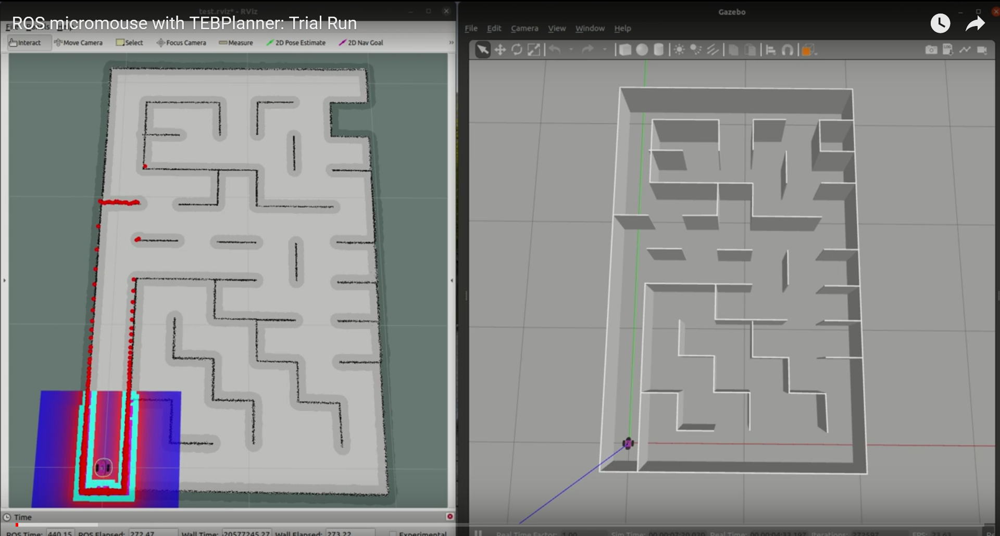
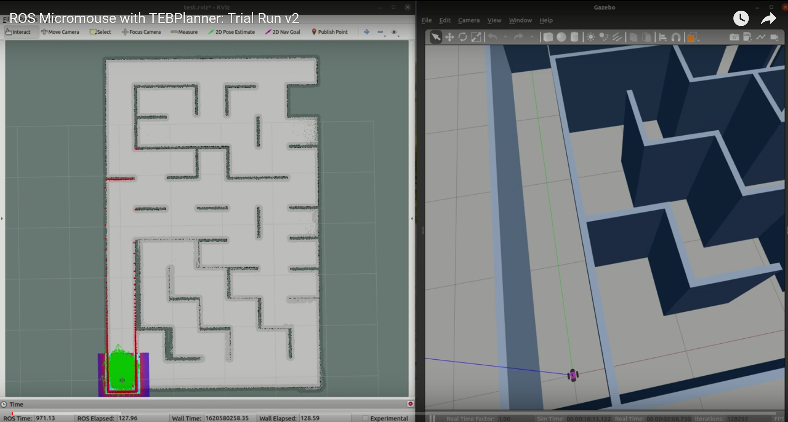
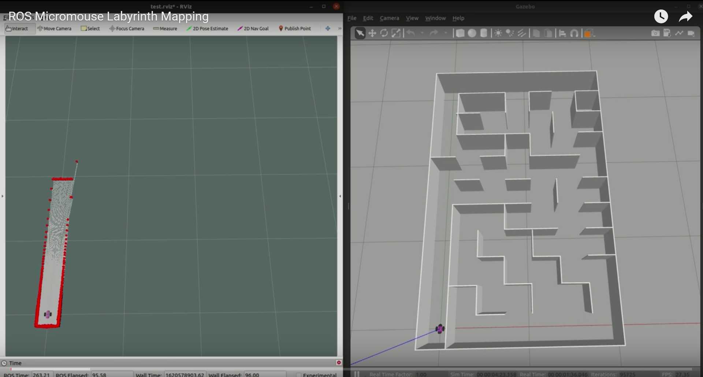

[//]: # (Image References)

[image1]: ./assets/robot_body.png "Robot modell"
[image2]: ./assets/robot_wheel.png "Robot modell"
[image3]: ./assets/lidar.png "Robot modell"
[image4]: ./assets/robot_rviz.png "Robot modell"
[image5]: ./assets/robot_gazebo.png "Robot modell"
[image6]: ./assets/gmapping_in_progress.png "GMapping"
[image7]: ./assets/gmapping_finished.png "GMapping"
[image8]: ./assets/amcl_0.png "AMCL"
[image9]: ./assets/amcl_1.png "AMCL"

# Micrimouse ROS

# Videók az eredmények bemutatásáról

<a href="https://youtu.be/doHhJ7wtTCQ"></a>

<a href="https://youtu.be/6O1bzjymoWA"></a>

<a href="https://youtu.be/0kCB9RVPd6E"></a>

# Tartalomjegyzék
1. [Projekt bemutása](#Projekt-bemutatása)
2. [ROS Noetic telepítése (ha szükséges)](#ROS-Noetic-telepítése)  
3. [Labirintus](#Labirintus)  
4. [Robot felépítése](#Robot-felépítése)  
4.1 [Robot modell](#Robot-modell)   
4.2 [Laser filter](#Laser-filter)
5. [Labirintus feltérképező algoritmus](#Labirintus-feltérképező-algoritmus)  
6. [Mapping](#Mapping)
7. [Lokalizáció](#Lokalizáció)  
7.1. [AMCL](#AMCL)
8. [Navigáció](#Navigáció)  
8.1. [Navigáció tesztelése](#Navigáció-tesztelése)  
8.2. [Paratméterek módosítása RVizben](#Paratméterek-módosítása-RVizben)  
9. [Összefoglalás](#Összefoglalás)

# Projekt bemutatása
Projektünk az alábbi feladatokból épült fel:
1) Micromouse jellegű labirintus készítése.
2) A labirintus tartalmazzon átlós haladást lehetővé tévő szakaszt.
3) Labirintus feltérképezése.
4) Útvonaltervezés a labirintuson való végigvezetésre saját ROS node-dal.

Dokumentációnkban részletesen bemutatjuk az egyes feladatok megvalósítását.

A projekt során a ROS Noetic disztribúciót használtuk, így ha ez nincs telepítve, akkor szükség van a következő fejeztben bemutatott lépések végrehajtására, mielőtt a git repository le lenne klónozva.

A teljes csomag (amely már minden szükséges fájlt tartalmaz) letölthető az alábbi paranncsal:
```console
git clone https://github.com/horilehel/Micromouse_ROS.git
```

A projekt tartalma:
```console
beni9708@DESKTOP-GSPKIBL:~/catkin_ws/src/Micromouse_ROS/bme_ros_micromouse$ tree
.
├── CMakeLists.txt
├── config
│   ├── costmap_common_params.yaml
│   ├── dwa_local_planner_params.yaml
│   ├── global_costmap_params.yaml
│   ├── global_planner_params.yaml
│   ├── local_costmap_params.yaml
│   ├── move_base_params.yaml
│   ├── my_laser_config.yaml
│   └── teb_local_planner_params.yaml
├── launch
│   ├── amcl.launch
│   ├── check_urdf.launch
│   ├── gmapping.launch
│   ├── laser_filter.launch
│   ├── navigation.launch
│   ├── spawn_robot.launch
│   ├── teleop.launch
│   └── world.launch
├── maps
│   └── saved_maps
│       ├── map.pgm
│       ├── map.yaml
│       ├── map_old.pgm
│       └── map_old.yaml
├── meshes
│   ├── body.dae
│   ├── lidar.dae
│   └── wheel.dae
├── package.xml
├── rviz
│   ├── test.rviz
│   ├── umouse_robot.rviz
│   └── world.rviz
├── scripts
│   ├── map_labyrinth.py
│   ├── map_labyrinth60.py
│   └── nav_goals.py
├── urdf
│   ├── materials.xacro
│   ├── umouse_robot.gazebo
│   └── umouse_robot.xacro
└── worlds
    ├── labyrinth_30cm.world
    ├── labyrinth_3m.world
    └── labyrinth_60cm.world
```

# ROS Noetic telepítése

Ahhoz, hogy a proejktünkben bemutatott funkciók biztosan működjenek, [ROS Noeticre](http://wiki.ros.org/noetic/Installation/Ubuntu) van szükség. Ha már fel van telepítve akkor ez a fejezet kihagyható, ha nincs, akkor pedig az alábbi parancsok futtatásával feltepíthető:
```console
sudo sh -c 'echo "deb http://packages.ros.org/ros/ubuntu $(lsb_release -sc) main" > /etc/apt/sources.list.d/ros-latest.list'
sudo apt-key adv --keyserver 'hkp://keyserver.ubuntu.com:80' --recv-key C1CF6E31E6BADE8868B172B4F42ED6FBAB17C654
sudo apt update
sudo apt install ros-noetic-desktop-full
```
Ezután a `.bashrc` fájlt kiegészíthetjük, a `source /opt/ros/noetic/setup.bash` paranncsal. Ezt akkor érdemes megtenni, ha csak ezt a disztribúciót akarjuk használni a gépen. Így nem kell kézzel betölteni a ROS alap környezetét.

Ezt követően létre kell hoznunk a Noetichez tartozó Catkin workspace-t:
```console
cd ~
mkdir -p catkin_ws/src
cd catkin_ws
catkin_make
```
A `.bashrc` fájlt ismét kiegészíthetjük, most a `source ~/catkin_ws/devel/setup.bash` paranncsal. Ezt akkor érdemes megtenni, ha nem akarjuk minden új terminálban manuálisan lefuttatni a kódót.

# Labirintus

# Robot felépítése
A robot tervezése során szempont volt, hogy hasonlítson a Micromouse során használt robotokhoz. Egy testből, a hozzá középen csatalkoztatott két kerékből, valamint a tetején elhejezkedő lidar szenzorból épül fel. Mozgatásához differenciál hajtást használtunk. Ezen kívül hozzáadtunk egy laser filtert, hogy a navigáció során kiszűrhessük a túlságosan kis távlságra lévő jeleket, amik jellemzően a gyorsítás és fékezés során a robot dőléséből adódtak.

# Robot modell
A 3D modelleket Blenderben készítettük el (kivéve a lidart, aminek a modelljét a Week-3-4-Gazebo-basics csomagból kölcsönöztük).

![alt text][image1]

![alt text][image2]

![alt text][image3]

A robot alvázát, kerekeit, a szenzorokat és ezeknek a megjelenítését és tuladjonságait a `umouse_robot.xacro` fájlban tudjuk megadni. Itt tudjuk azt is beállítani, hogy a testek megjelenítésekor a Blenderben készült modelleket láthassuk.

![alt text][image4]

![alt text][image5]

Ahhoz, hogy használhassuk a modellünket a szimulációs környezetben, be kell még kötni a gazeboba a differenciálhajtáshoz és a lidarhoz szükséges pluginokat a `umouse_robot.gazebo`.

# Laser filter

A robotunk teste 10cm hosszú és a közepén helyezkedik a lidar szenzor. Gyorsításkor és fékezéskor előfordult, hogy megbillent a robot, és a lidar "látta" a földet, ezért szűrjük a lidar jeleit és a lidar 8cm-es sugarú környezetén belül nem veszi figyelembe a jeleket. A filter beállításait a `my_laser_config.yaml` tartalmazza. 

```yaml
  scan_filter_chain:
  - name: range
    type: laser_filters/LaserScanRangeFilter
    params:
      use_message_range_limits: false
      lower_threshold: 0.08
      upper_threshold: .inf
      lower_replacement_value: -.inf
      upper_replacement_value: .inf
```

# Labirintus feltérképező algoritmus

# Mapping

Térképezésre az órán bemutatott SLAM (simultaneous localization and mapping) algoritmusok közül a GMappinget használtuk. Azért esett erre a választás, mert a lidar és az odometria jelek felhasználásával pontosan képes leképezni a robot általál bejárt területeket. Az elkészült térképet majd a Map server segítségével tujduk elmenteni.

A [GMapping](http://wiki.ros.org/gmapping) és [Map server](http://wiki.ros.org/map_server) nem része az alap ROS csomagnak, ezért telepítenünk kell őket:
```console
sudo apt install ros-noetic-gmapping
sudo apt install ros-noetic-map-server
```

Ezután az alábbi parancsokkal futtatva betöltjük a környezetet, elindítjuk a térképezést a labirintus felderítő algoritmust.

```console
roslaunch bme_ros_micromouse spawn_robot.launch
roslaunch bme_ros_micromouse gmapping.launch
rosrun bme_ros_micromouse map_labyrinth.py
```

Az alábbi képen a labirintus bejárása látható. A piros vonalak a lidar által látott falak, a szürke terület pedig a GMapping által már feltérképezett területet jelöli.

![alt text][image6]

![alt text][image7]

Miután a robot elérte a kijelölt pontokat és kész a térkép, a `map_server` csomag `map_saver` node-jával elmenthetjük. A `map_saver` node oda menti a térképet, amelyik mappából indítjuk. Esetünkben az alábbi kód használható:

```console
cd ~/catkin_ws/src/Micromouse_ROS/bme_ros_micromouse/maps/saved_maps/30cm
rosrun map_server map_saver -f map
```

# Lokalizáció

Lokalizációra az órán bemutatott ROS [AMCL (Advanced Monte Carlo Localization) csomagját](http://wiki.ros.org/amcl) használtuk egy ismert térképen. A GMapping által készített térképet használtuk fel, mert a robot saját szenzorai által készített térképen sokkal pontosabban tudja megtalálni a valódi pozícióját.

Az AMCL az alábbi paranncsal telepíthető:
```console
sudo apt install ros-noetic-amcl
```
Ahhoz, hogy az AMCL a megfelelő helyre konvergáljon megadtuk, hogy nagyjából mi a robot kezdeti pozíciója és orientációja.

```xml
    <!-- If you choose to define initial pose here -->
    <param name="initial_pose_x" value="$(arg initial_pose_x)"/>
    <param name="initial_pose_y" value="$(arg initial_pose_y)"/>
    <param name="initial_pose_a" value="$(arg initial_pose_a)"/>
    <!-- Parameters for inital particle distribution -->
    <param name="initial_cov_xx" value="0.01"/>
    <param name="initial_cov_yy" value="0.01"/>
    <param name="initial_cov_aa" value="0.01"/>
```

Az alábbi képeken jól látható, hogy a kezdetben a kiindulási pont körül szétszórt particle-ök a haladás során a megfelelő pontba konvergálnak.

![alt text][image8]

![alt text][image9]

# Navigáció

A [ROS nyílt forrású navigációs stackje](http://wiki.ros.org/navigation) számos lehetőséget kíván a navigáció megvalósítására. Odometria és szenzor adatok a bemenetei és sebesség utatsítások a kimenetei amiket a mobil robotunknak továbbíthatunk. Nagyrészt az órán használt csomagokat használtuk fel:
1) Lokalizációra az AMCL-t használtuk a már korábban rögzített térképekkel.
2) Globlális útvonaltervezésre a [NavfnROS](http://wiki.ros.org/navfn) csomagot használtuk. Ez az útvonaltervező képes volt a legrövidebb útvonal megtalálására a labirintuson belül.
3) Lokális tervezéshez két csomagot próbáltunk ki:    
a) Az első a [DWAPlannerROS](http://wiki.ros.org/dwa_local_planner) csomagot próbáltuk meg használni, azonban ezzel több problémánk is volt. A legnagyobb gond, a szűk helyek miatt adódott. Számos alkalommal előfordult, hogy nem egy optimális íven próbált meg fordulni, illetve olyan is volt, hogy már a kanyar előtt elfordult és nekiment a falnak.   
b) Ezután a [TEBPlannert](http://wiki.ros.org/teb_local_planner) próbáltuk ki. Ez a csomag jóval több paramétert tartalmaz, így ezek behangolása jóval több időt vett igénybe. Hatalmas előnye, hogy ez a csomag képes szűkebb helyeken is mozogni úgy, hogy igyekszik a megadott távolságat tartani minden akadálytól.

# Navigáció tesztelése

A navigációs launch fájlok futtatásához az alábbi csomagok telepítésére van szükség:

```console
sudo apt-get install ros-noetic-move-base
sudo apt install ros-noetic-move-slow-and-clear
sudo apt install ros-noetic-dwa-local-planner
sudo apt install ros-noetic-teb-local-planner
```

Ezt követően a `spawn_robot.launch` fájl futtatásával betölthetjük a robotot és a labirintust, majd a `navigation.launch` fájllal a navigációhoz szükséges csomagokat indíthatjuk el.

```console
roslaunch bme_ros_micromouse spawn_robot.launch
roslaunch bme_ros_micromouse navigation.launch
```

A robot célpontját megadhatjuk RVizben a 2D Nav Goal-lal. A globális útvonaltervező megtervezi az ide vezető legrövidebb utat, majd pedig a lokális tervező felel a a robot környezetében az útvonal megfelelő módosításáért.


# Paratméterek módosítása RVizben

# Összefoglalás
