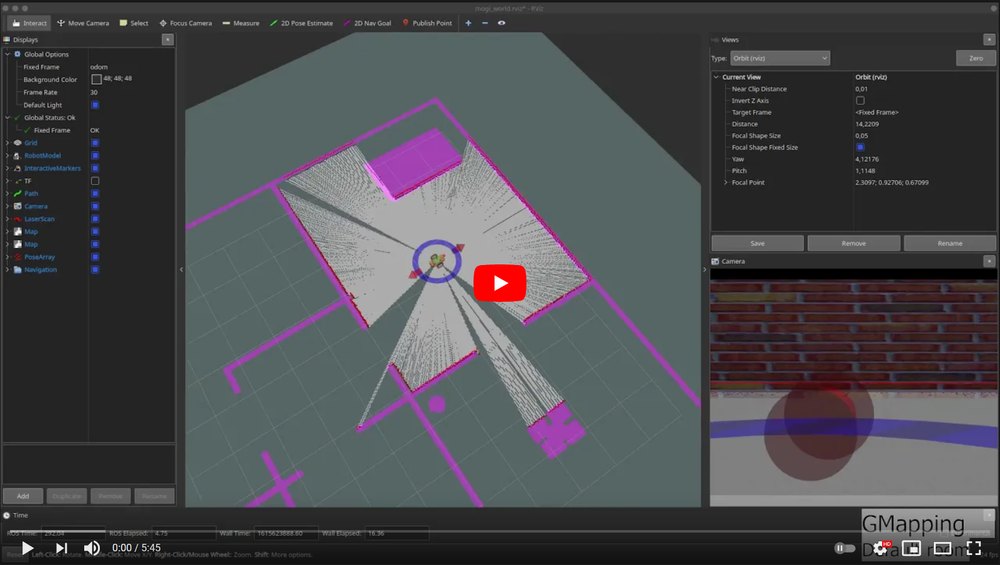

[//]: # (Image References)

[image1]: ./assets/robot_body.png "Robot modell"
[image2]: ./assets/robot_wheel.png "Robot modell"
[image3]: ./assets/lidar.png "Robot modell"
[image4]: ./assets/robot_rviz.png "Robot modell"
[image5]: ./assets/robot_gazebo.png "Robot modell"

# Micrimouse ROS

# Videó az eredmények bemutatásáról

<a href="https://youtu.be/XveJMrCh9vw"></a>

# Tartalomjegyzék
1. [Projekt bemutása](#Projekt-bemutatása)
2. [ROS Noetic telepítése (ha szükséges)](#ROS-Noetic-telepítése)  
3. [Labirintus](#Labirintus)  
4. [Robot felépítése](#Robot-felépítése)  
4.1 [Robot modell](#Robot-modell)   
4.2 [Laser filter](#Laser-filter)
5. [Labirintus feltérképező algoritmus](#Labirintus-feltérképező-algoritmus)  
6. [Mapping](#Mapping)
7. [Lokalizáció](#Lokalizáció)  
7.1. [AMCL](#AMCL)
8. [Navigáció](#Navigáció)  
8.1. [Recovery akciók](#Recovery-akciók)
9. [Összefoglalás](#Összefoglalás)

# Projekt bemutatása
Projektünk az alábbi feladatokból épült fel:
1) Micromouse jellegű labirintus készítése.
2) A labirintus tartalmazzon átlós haladást lehetővé tévő szakaszt.
3) Labirintus feltérképezése.
4) Útvonaltervezés a labirintuson való végigvezetésre saját ROS node-dal.

Dokumentációnkban részletesen bemutatjuk az egyes feladatok megvalósítását.

A projekt során a ROS Noetic disztribúciót használtuk, így ha ez nincs telepítve, akkor szükség van a következő fejeztben bemutatott lépések végrehajtására, mielőtt a git repository le lenne klónozva.

A teljes csomag (amely már minden szükséges fájlt tartalmaz) letölthető az alábbi paranncsal:
```console
git clone https://github.com/horilehel/Micromouse_ROS.git
```

A projekt tartalma:
```console
beni9708@DESKTOP-GSPKIBL:~/catkin_ws/src/Micromouse_ROS/bme_ros_micromouse$ tree
.
├── CMakeLists.txt
├── config
│   ├── costmap_common_params.yaml
│   ├── dwa_local_planner_params.yaml
│   ├── global_costmap_params.yaml
│   ├── global_planner_params.yaml
│   ├── local_costmap_params.yaml
│   ├── move_base_params.yaml
│   ├── my_laser_config.yaml
│   └── teb_local_planner_params.yaml
├── launch
│   ├── amcl.launch
│   ├── check_urdf.launch
│   ├── gmapping.launch
│   ├── laser_filter.launch
│   ├── navigation.launch
│   ├── spawn_robot.launch
│   ├── teleop.launch
│   └── world.launch
├── maps
│   └── saved_maps
│       ├── map.pgm
│       ├── map.yaml
│       ├── map_old.pgm
│       └── map_old.yaml
├── meshes
│   ├── body.dae
│   ├── lidar.dae
│   └── wheel.dae
├── package.xml
├── rviz
│   ├── test.rviz
│   ├── umouse_robot.rviz
│   └── world.rviz
├── scripts
│   ├── map_labyrinth.py
│   ├── map_labyrinth60.py
│   └── nav_goals.py
├── urdf
│   ├── materials.xacro
│   ├── umouse_robot.gazebo
│   └── umouse_robot.xacro
└── worlds
    ├── labyrinth_30cm.world
    ├── labyrinth_3m.world
    └── labyrinth_60cm.world
```

# ROS Noetic telepítése

Ahhoz, hogy a proejktünkben bemutatott funkciók biztosan működjenek, [ROS Noeticre](http://wiki.ros.org/noetic/Installation/Ubuntu) van szükség. Ha már fel van telepítve akkor ez a fejezet kihagyható, ha nincs, akkor pedig az alábbi parancsok futtatásával feltepíthető:
```console
sudo sh -c 'echo "deb http://packages.ros.org/ros/ubuntu $(lsb_release -sc) main" > /etc/apt/sources.list.d/ros-latest.list'
sudo apt-key adv --keyserver 'hkp://keyserver.ubuntu.com:80' --recv-key C1CF6E31E6BADE8868B172B4F42ED6FBAB17C654
sudo apt update
sudo apt install ros-noetic-desktop-full
```
Ezután a `.bashrc` fájlt kiegészíthetjük, a `source /opt/ros/noetic/setup.bash` paranncsal. Ezt akkor érdemes megtenni, ha csak ezt a disztribúciót akarjuk használni a gépen. Így nem kell kézzel betölteni a ROS alap környezetét.

Ezt követően létre kell hoznunk a Noetichez tartozó Catkin workspace-t:
```console
cd ~
mkdir -p catkin_ws/src
cd catkin_ws
catkin_make
```
A `.bashrc` fájlt ismét kiegészíthetjük, most a `source ~/catkin_ws/devel/setup.bash` paranncsal. Ezt akkor érdemes megtenni, ha nem akarjuk minden új terminálban manuálisan lefuttatni a kódót.

# Labirintus

# Robot felépítése
A robot tervezése során szempont volt, hogy hasonlítson a Micromouse során használt robotokhoz. Egy testből, a hozzá középen csatalkoztatott két kerékből, valamint a tetején elhejezkedő lidar szenzorból épül fel. Mozgatásához differenciál hajtást használtunk. Ezen kívül hozzáadtunk egy laser filtert, hogy a navigáció során kiszűrhessük a túlságosan kis távlságra lévő jeleket, amik jellemzően a gyorsítás és fékezés során a robot dőléséből adódtak.

# Robot modell
A 3D modelleket Blenderben készítettük el (kivéve a lidart, aminek a modelljét a Week-3-4-Gazebo-basics csomagból kölcsönöztük).

![alt text][image1]

![alt text][image2]

![alt text][image3]

A robot alvázát, kerekeit, a szenzorokat és ezeknek a megjelenítését és tuladjonságait a `umouse_robot.xacro` fájlban tudjuk megadni. Itt tudjuk azt is beállítani, hogy a testek megjelenítésekor a Blenderben készült modelleket láthassuk.

![alt text][image4]

![alt text][image5]

Ahhoz, hogy használhassuk a modellünket a szimulációs környezetben, be kell még kötni a gazeboba a differenciálhajtáshoz és a lidarhoz szükséges pluginokat a `umouse_robot.gazebo`.

# Laser filter

A robotunk teste 10cm hosszú és a közepén helyezkedik a lidar szenzor. Gyorsításkor és fékezéskor előfordult, hogy megbillent a robot, és a lidar "látta" a földet, ezért szűrjük a lidar jeleit és a lidar 8cm-es sugarú környezetén belül nem veszi figyelembe a jeleket. A filter beállításait a `my_laser_config.yaml` tartalmazza. 

```yaml
  scan_filter_chain:
  - name: range
    type: laser_filters/LaserScanRangeFilter
    params:
      use_message_range_limits: false
      lower_threshold: 0.08
      upper_threshold: .inf
      lower_replacement_value: -.inf
      upper_replacement_value: .inf
```

# Labirintus feltérképező algoritmus

# Mapping

Térképezésre az órán bemutatott SLAM (simultaneous localization and mapping) algoritmusok közül a GMappinget használtuk. Azért esett erre a választás, mert a lidar és az odometria jelek felhasználásával pontosan képes leképezni a robot általál bejárt területeket. Az elkészült térképet majd a Map server segítségével tujduk elmenteni.

A [GMapping](http://wiki.ros.org/gmapping) és [Map server](http://wiki.ros.org/map_server) nem része az alap ROS csomagnak, ezért telepítenünk kell őket:
```console
sudo apt install ros-noetic-gmapping
sudo apt install ros-noetic-map-server
```

Ezután az alábbi parancsokkal futtatva betöltjük a környezetet, elindítjuk a térképezést a labirintus felderítő algoritmust.

```console
roslaunch bme_ros_micromouse spawn_robot.launch
roslaunch bme_ros_micromouse gmapping.launch
rosrun bme_ros_micromouse map_labyrinth.py
```

Miután a robot elérte a kijelölt pontokat és kész a térkép, a `map_server` csomag `map_saver` node-jával elmenthetjük. A `map_saver` node oda menti a térképet, amelyik mappából indítjuk. Esetünkben az alábbi kód használható:

```console
cd ~/catkin_ws/src/Micromouse_ROS/bme_ros_micromouse/maps/saved_maps
rosrun map_server map_saver -f map
```

# Lokalizáció

Lokalizáció esetén a robotunk pontos pozícióját és orientációját határoztuk meg egy ismert térképen. Ehhez a ROS [AMCL (Advanced Monte Carlo Localization) csomagját](http://wiki.ros.org/amcl) fogjuk használni. Ez a lokalizációs módszer egy úgynevezett particle filter algoritmus, ami induláskor véletlenszerűen "szór szét" particle-öket a téképen, és a lidar szenzoradataiból próbálja kiszűrni azokat a lehetséges particle-öket, amikkel konzisztensek a szenzoradataink. Ahogy mozgunk a robottal a lehetséges particle-ök a robot valós helyéhez konvergálnak.

## AMCL

Az AMCL sem része az alap ROS telepítésnek, így tegyük fel ezt a csomagot:
```console
sudo apt install ros-$(rosversion -d)-amcl
```

Majd hozzuk létre az `amcl.launch` fájlt. Ebben az esetben nem lesz szükségünk a ground truth térképre, és vegyük észre, hogy alapértelmezetten a korábbi térképezés által rögzített térképet töltjük be a `map_server`-nek.

```xml
<?xml version="1.0"?>
<launch>

  <!-- Map file for localization -->
  <arg name="map_file" default="$(find bme_ros_navigation)/maps/saved_maps/map.yaml"/>
  <!-- It can be an environmental variable, too -->
  <!--arg name="map_file" default="$(env AMCL_MAP_FILE)"/-->

  <!-- Map Server -->
  <node name="map_server" pkg="map_server" type="map_server" args="$(arg map_file)">
  </node>

  <!-- AMCL Node -->
  <arg name="initial_pose_x"  default="0.0"/>
  <arg name="initial_pose_y"  default="0.0"/>
  <arg name="initial_pose_a"  default="1.57"/>
  <node name="amcl" pkg="amcl" type="amcl" output="screen">
    <param name="odom_frame_id" value="odom"/>
    <param name="odom_model_type" value="diff-corrected"/>
    <param name="base_frame_id" value="base_link"/>
    <param name="global_frame_id" value="map"/>
    <param name="scan_topic" value="scan"/>
    <!-- If you choose to define initial pose here -->
    <param name="initial_pose_x" value="$(arg initial_pose_x)"/>
    <param name="initial_pose_y" value="$(arg initial_pose_y)"/>
    <param name="initial_pose_a" value="$(arg initial_pose_a)"/>
    <!-- Parameters for inital particle distribution -->
    <param name="initial_cov_xx" value="9.0"/>
    <param name="initial_cov_yy" value="9.0"/>
    <param name="initial_cov_aa" value="9.8"/>
    <!-- Dynamically adjusts particles for every iteration -->
    <param name="min_particles" value="500"/>
    <param name="max_particles" value="2000"/>
    <!-- Perform update parameters -->
    <param name="update_min_d" value="0.1"/>
    <param name="update_min_a" value="0.1"/>
    <param name="laser_model_type" value="likelihood_field"/>
    <param name="laser_max_range" value="-1.0"/>
    <param name="odom_alpha1" value="0.1"/>
    <param name="odom_alpha2" value="0.1"/>
    <param name="odom_alpha3" value="0.3"/>
    <param name="odom_alpha4" value="0.1"/>
    <param name="odom_alpha5" value="0.1"/>
    <!-- Transform tolerance needed on slower machines -->
    <param name="transform_tolerance" value="1.0"/>
  </node>

</launch>
```

Indítsuk el a szimulációt:

```console
roslaunch bme_ros_navigation spawn_robot.launch
```

Indítsuk el az AMCL-t is, azonban ne az alapértelmezett mentett térképpel, hanem először a ground truth térképpel:
```console
roslaunch bme_ros_navigation amcl.launch map_file:='$(find bme_ros_navigation)/maps/map.yaml'
```

Indítsunk egy távirányítót is, viszont mielőtt nekiállnánk vezetni, nézzünk rá az rqt_graph-ra és a TF tree-re!

```console
roslaunch bme_ros_navigation teleop.launch
```

![alt text][image13]
![alt text][image25]

Próbáljuk ki a lokalizációt, mozogjunk a robotunkkal:

Azt tapasztaljuk, hogy az ennyire tökéletes térkép nehézséget okoz az AMCL-nek, érdemes olyan térképpel használnunk a lokalizációt, ami azzal a szenzorral készült, amit a lokalizációs is használ!

Most indítsuk e a mentett térképpel, és nézzük meg mi történik:
```console
roslaunch bme_ros_navigation amcl.launch
```

![alt text][image26]
![alt text][image27]
![alt text][image28]

Próbáljuk ki a lokalizációt a folyosón is:
```console
roslaunch bme_ros_navigation spawn_robot.launch world:='$(find bme_ros_navigation)/worlds/20m_corridor_features.world' x:=-7 y:=2
```

```console
roslaunch bme_ros_navigation amcl.launch map_file:='$(find bme_ros_navigation)/maps/saved_maps/corridor.yaml'
```
Induláskor az AMCL-nek fogalma sincs, hogy hol a robot, ahogy ezt korábban is láttuk:
![alt text][image29]

Mivel ezen a térképen nagyon kevés jól felismerhető feature van, elképzelhető, hogy az AMCL tévesen lokalizálja a robotot:
![alt text][image30]

Ha vezetjük tovább a robotot, a particle-ök elkezdenek divergálni a robot pozíciójától:
![alt text][image31]

Ez addig fokozódik, amíg új particle-ök jelennek meg:
![alt text][image32]

És egy idő után képes sikeresen lokalizálni a robotunkat:
![alt text][image33]

Téves konvergálást úgy tudunk a legjobban elkerülni, ha van valamennyi elképzelésünk a robotunk kezdeti pozíciójáról és orientációjáról. Ezeket a launch fájlban megadhatjuk, és csökkenthetjük a kezdeti részecskék eloszlását, erről [bővebben az AMCL wiki oldalán olvashattok](http://wiki.ros.org/amcl#Parameters):

```xml
    <!-- If you choose to define initial pose here -->
    <param name="initial_pose_x" value="$(arg initial_pose_x)"/>
    <param name="initial_pose_y" value="$(arg initial_pose_y)"/>
    <param name="initial_pose_a" value="$(arg initial_pose_a)"/>
    <!-- Parameters for inital particle distribution -->
    <param name="initial_cov_xx" value="9.0"/>
    <param name="initial_cov_yy" value="9.0"/>
    <param name="initial_cov_aa" value="9.8"/>
```

Az AMCL-nek adhatunk egy kezdeti pozíciót is az RViz segítségével:
![alt text][image36]
Fontos megjegyezni, hogy ezt csak a `map` frame-ben tehetjük meg, az `odom`-ban nem!
![alt text][image37]

# Navigáció

A [ROS nyílt forrású navigációs stackje](http://wiki.ros.org/navigation) hatalmas, úgyhogy az implementációjának részleteibe nem megyünk bele, a legfontosabb tulajdonságait nézzük meg.

A navigációs stack működik tetszőleges SLAM vagy lokalizációs csomaggal, ebben az esetben mi egy előre rögzített térképen az AMCL-t használjuk majd lokalizációra.

A navigációs stacket úgy tervezték, hogy könnyen használható legyen különböző lokális és globális útvonaltervezővel. A globális tervezéshez a [NavfnROS](http://wiki.ros.org/navfn) csomagot, a lokális tervezéshez pedig a [DWAPlannerROS](http://wiki.ros.org/dwa_local_planner) csomagot fogjuk használni.

A ROS navigációs stackjének működése kapcsán érdemes végig nézni a [hivatalos tutorialok](http://wiki.ros.org/navigation/Tutorials)at, valamint a [ROS Navigation Tuning Guide](http://kaiyuzheng.me/documents/navguide.pdf)-ot Kaiyu Zheng-től.

A navigációs stack-et a [`move_base`](http://wiki.ros.org/move_base) node indítja el, és ez a belső felépítése:
![alt text][image35]

A fő részei tehát:
1) Globális costmap, gyakorlatilag ez a térkép, a robot környezetében lévő statikus akadályok szerepelnek rajta, amiket megnövelünk, hogy elkerüljük a potenciális ütközést velük. A robot a navigáció során nem használja közvetlenül a robot szenzorjait ennek a frissítéséhez.
2) A globális útvonaltervező az előbbi global costmap-et használja fel a tervezéshez, odafigyelve arra, hogy a robot fizikai méretének megfelelően tervezze meg az útvonalat.
3) Lokális costmap, ezen szerepelnek a robot környezetében lévő dinamikus akadályok, például állatok és emberek, de a térképhez képest történt változások is a lokális costmapen jelennek meg. A lokális costmap mindig az aktuális szenzoradatok alapján frissül.
4) A lokális útvonaltervező célja a globális útvonal követése a dinamikus akadályok elkerülése mellett. Tehát a robot képes kikerülni az akadályt majd visszatérni a globális útvonaltervhez.

Készítsük el a `navigation.launch` fájlt, és nézzük meg a tartalmát:

```xml
<?xml version="1.0"?>
<launch>

  <!-- Map file for localization -->
  <arg name="map_file" default="$(find bme_ros_navigation)/maps/saved_maps/map.yaml"/>

  <!-- Launch our Gazebo world -->
  <include file="$(find bme_ros_navigation)/launch/amcl.launch">
    <!-- all vars that included.launch requires must be set -->
    <arg name="map_file" value="$(arg map_file)" />
  </include>

  <!-- Move Base -->
  <node name="move_base" pkg="move_base" type="move_base" respawn="false" output="screen">
    <rosparam file="$(find bme_ros_navigation)/config/move_base_params.yaml" command="load" />
    <rosparam file="$(find bme_ros_navigation)/config/costmap_common_params.yaml" command="load" ns="global_costmap" />
    <rosparam file="$(find bme_ros_navigation)/config/costmap_common_params.yaml" command="load" ns="local_costmap" />
    <rosparam file="$(find bme_ros_navigation)/config/local_costmap_params.yaml" command="load" />
    <rosparam file="$(find bme_ros_navigation)/config/global_costmap_params.yaml" command="load" />
    <rosparam file="$(find bme_ros_navigation)/config/dwa_local_planner_params.yaml" command="load" />
  </node>

</launch>
```

A navigációs stack annyira sok paramétert használ, hogy nem érdemes ezeket a launch fájlban tartani, helyette kiszervezzük `.yaml` fájlokba a config mappán belülre.

## Recovery akciók
A `move_base_params.yaml` fájlban találjuk a robot recovery akcióit, amit abban az esetben hajt végre, ha valamilyen oknál fogva elakadna a terve végrehajtásában.

```yaml
recovery_behavior_enabled: true
recovery_behaviors:
  - name: 'conservative_reset'
    type: 'clear_costmap_recovery/ClearCostmapRecovery'
  - name: 'aggressive_reset'
    type: 'clear_costmap_recovery/ClearCostmapRecovery'
  - name: 'move_slow_and_clear'
    type: 'move_slow_and_clear/MoveSlowAndClear'
  - name: 'rotate_recovery'
    type: 'rotate_recovery/RotateRecovery'

conservative_reset:
  reset_distance: 3.0
  layer_names: ["obstacle_layer"]

aggressive_reset:
  reset_distance: 0.0
  layer_names: ["obstacle_layer"]

move_slow_and_clear:
  clearing_distance: 0.5
  limited_trans_speed: 0.25
  limited_rot_speed: 0.45
  limited_distance: 0.3

rotate_recovery:
  max_vel_theta: 0.3
  acc_lim_theta: 3.0
```

A recovery első lépése a robot körüli costmap-ek törlése. Ezt a törlést kézzel is végre tudjuk hajtani a megfelelő service hívással:
```console
rosservice call /move_base/clear_costmaps "{}"
```

Ha ezek után sem tudná folytatni a robot a tervezett útvonalát, akkor valószínűleg nagyon közel van valami akadályhoz, és ki kéne jutnunk erről a területről, ezért hajtja végre a `move_slow_and_clear` akciót, ami nem teljesen biztonságos, vezethet ütközéshez, de a legtöbb esetben ez a praktikus megoldás. Ennek a használatához telepíteni kell a megfelelő csomagot:
```console
sudo apt install ros-$(rosversion -d)-move-slow-and-clear
```

Ha ez sem vált volna be, akkor végső próbálkozásként megpróbálunk forogni a robottal. Ez egyébként a navigációs stack alapértelmezett recovery mechanizmusa, ami azonban a gyakorlatban egy valós roboton nagyon nem praktikus.

Próbáljuk ki a navigációt, ezúttal nem is lesz szükségünk a távirányítóra:
```console
roslaunch bme_ros_navigation spawn_robot.launch
```
```console
roslaunch bme_ros_navigation navigation.launch
```

Induláskor, ahogy korábban már láttuk, az AMCL még nem lokalizálta a robot. A falak mentén a világos szürke sávok a globális costmap megjelenítése.
![alt text][image38]
Ezen segíthetünk a távirányítóval, vagy adhatunk egy célpontot a navigációnak.
![alt text][image39]
Előfordulhat, hogy az AMCL kezdetben rosszul lokalizálja a robotot.
![alt text][image40]
De némi mozgás után sikeresen lokalizálja a robotot.
![alt text][image41]
Majd a robot eléri a célpontját.
![alt text][image42]
Bármikor adhatunk új célpontot. A robot körül lévő costmap-et a lokális DWA Planner hozza létre. Ez nem a local costmap!
![alt text][image43]
A local costmap-et láthatjuk például a falak mentén.
![alt text][image44]

Próbáljuk ki a navigációt a folyosón is!
```console
roslaunch bme_ros_navigation spawn_robot.launch world:='$(find bme_ros_navigation)/worlds/20m_corridor_features.world' x:=-7 y:=2
```
```console
roslaunch bme_ros_navigation navigation.launch map_file:='$(find bme_ros_navigation)/maps/saved_maps/corridor.yaml'
```

Most is segíthetünk az AMCL-nek a kezdeti lokalizációval:
![alt text][image45]
Ezután már kijelölhetjük az úticélt:
![alt text][image46]
![alt text][image47]
![alt text][image48]

# Összefoglalás
